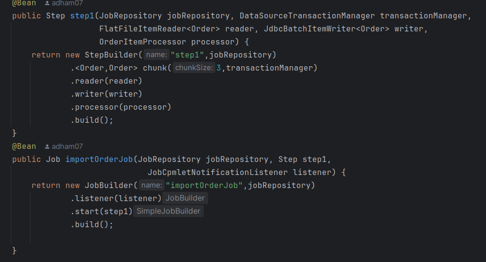

# TP Spring Batch

## Table of Contents
- [Introduction](#introduction)
- [Technologies Used](#technologies-used)
- [Architecture](#architecture)
- [Screen Shots](#screen-shots)
- [Execution](#execution)

## Introduction
This TP is a proof of concept for Orders Transformation. It is built using a spring batch and hsql to get used to spring batch logic and process

## Technologies Used
- **Backend:**
    - Spring Boot
    - Spring Batch
- **Database:**
    - HSQL

## Architecture
The application follows a Spring Batch architecture with the following components:
- Order.csv
- Sql Schema
- Order Entity
- Batch Configuration
- Processor
- Listener
- Scheduler

## Screen Shots

### Code Architecture

### Order.csv

### Schema SQL

### Order Entity

### Batch Config

### Processor

### Listener

### Scheduler

## Execution

